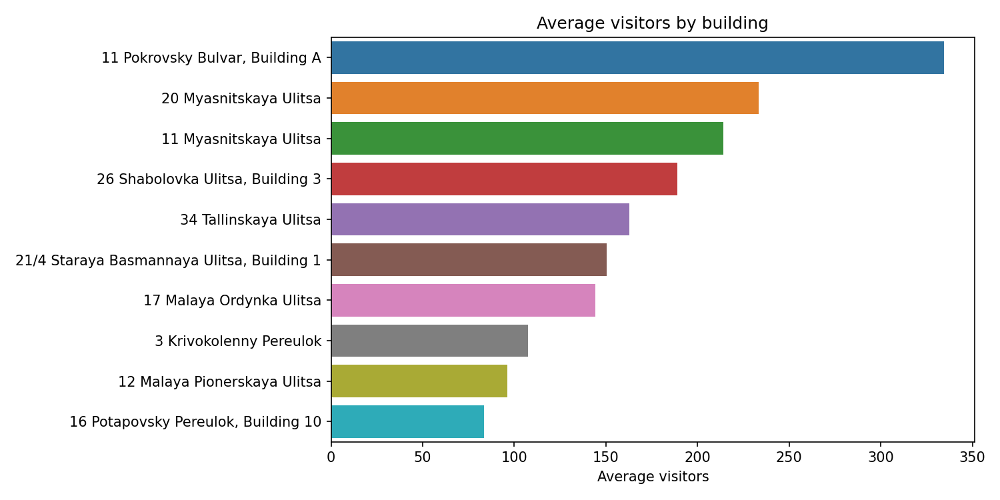
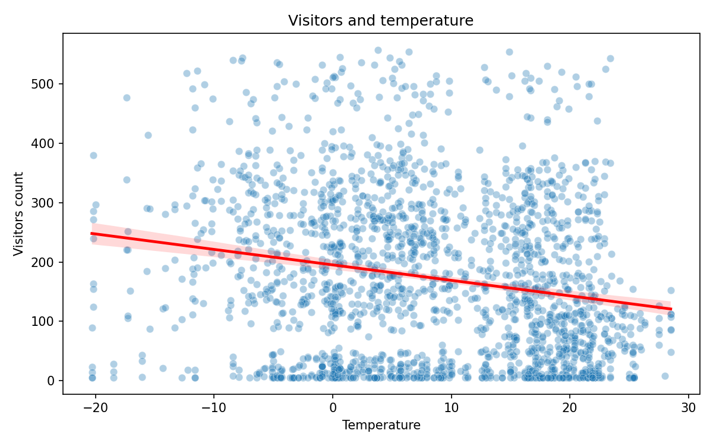

# Отчёт по проекту

**Студент:** Удалов Семён Борисович
**Группа:** 237

---

## 1. Введение и постановка задачи

- **Цель проекта:** предсказать дневное количество посетителей столовой ВУЗа для конкретного корпуса. Такой прогноз может помочь точнее планировать количество порций.
- **Формулировка задачи:** регрессия.
- **Целевая переменная:** `visitors_count`.
- **Основная метрика качества:** MAE. Она измеряется в людях и показывает среднюю абсолютную ошибку прогноза. Дополнительно считаются RMSE и R2: RMSE сильнее штрафует крупные ошибки, R2 показывает долю объяснённой дисперсии.

---

## 2. Поиск и описание данных

- **Источник данных:** открытого датасета ежедневной посещаемости корпусов ВШЭ нет, поэтому основной датасет синтетический. Примерную логику обсудил с Сергеем Николаевичем, поэтому она должна быть схожа с реальной.
- **Внешние источники для генерации:**
  - погодный CSV Open-Meteo Historical Forecast API для Москвы: средняя температура, влажность и сумма осадков по дням;
  - справочник 10 московских корпусов ВШЭ: `data/raw/buildings.csv`;
  - календарная структура ВШЭ: 4 модуля, периоды сессий и проектных сессий.
- **Запрос к Open-Meteo:**

```text
https://historical-forecast-api.open-meteo.com/v1/forecast?latitude=55.7558&longitude=37.6176&start_date=2024-04-25&end_date=2026-04-25&daily=temperature_2m_mean,relative_humidity_2m_mean,precipitation_sum&timezone=Europe%2FMoscow&format=csv
```

- **Параметры погодной выгрузки:** координаты Москвы `55.7558`, `37.6176`; период `2024-04-25` - `2026-04-25`; дневные признаки `temperature_2m_mean`, `relative_humidity_2m_mean`, `precipitation_sum`; часовой пояс `Europe/Moscow`; формат CSV.
- **Почему выбран такой подход:** синтетика позволяет получить достаточный объём данных и контролируемую зависимость между расписанием, календарём, погодой и посещаемостью.
- **Объём датасета после обработки:** 7310 строк, 23 столбца.
- **Период:** `2024-04-25` - `2026-04-25`.
- **Единица наблюдения:** одна строка = один корпус в один день.

---

## 3. Обработка и подготовка данных

- **Полная очистка:**
  - удалены полные дубликаты строк;
  - `date` приведён к дате;
  - числовые признаки приведены к числовым типам;
  - строки с пропущенным `visitors_count` удаляются, потому что без целевой переменной их нельзя использовать для обучения;
  - пропуски в признаках заполняются только статистиками train: медиана для числовых признаков, мода для категориальных;
  - выбросы `visitors_count` обрабатываются IQR-методом отдельно по каждому корпусу, но clipping применяется только к train.
- **Защита от data leakage:** сначала создаётся временной split, затем все статистики очистки считаются только на train. Validation и test не участвуют в расчёте медиан, мод и границ выбросов.
- **Исходные признаки:**
  - календарь: `date`, `weekday`, `month`, `module_number`, `session_progress`, `is_project_session`;
  - расписание: `avg_classes_today`, `avg_classes_morning`, `avg_classes_evening`;
  - погода: `forecast_temperature`, `forecast_precipitation_mm`, `relative_humidity`;
  - корпус: `building_id`, `building_address`, `campus`.
- **Новые фичи:**
  - `is_weekend` - выходной день;
  - `is_rainy` - есть осадки;
  - `is_strong_rain` - осадки не меньше 8 мм;
  - `classes_morning_share` - доля утренних пар;
  - `classes_evening_share` - доля вечерних пар;
  - `split` - служебная колонка для train/val/test.
- **Визуализации:** скрипт `src/make_plots.py` строит графики в `report/images/`.

| График | Файл |
|---|---|
| Распределение целевой переменной | `report/images/visitors_distribution.png` |
| Средняя посещаемость по корпусам | `report/images/visitors_by_building.png` |
| Средняя посещаемость по дням недели | `report/images/visitors_by_weekday.png` |
| Связь посещаемости и числа пар | `report/images/visitors_vs_classes.png` |
| Связь посещаемости и температуры | `report/images/visitors_vs_temperature.png` |
| Корреляционная матрица | `report/images/correlation_matrix.png` |








Короткие выводы по графикам:

- Распределение `visitors_count` смещено вправо: медиана 153 посетителя, среднее 171.5, максимум 585.
- Самый высокий средний поток у корпуса `11 Pokrovsky Bulvar, Building A`: 334.6 посетителя. Самый низкий - у `16 Potapovsky Pereulok, Building 10`: 83.3.
- В будни средняя посещаемость 230.5, в выходные 24.2. Это самая сильная календарная зависимость.
- Число пар сильно связано с посещаемостью: корреляция `avg_classes_today` с target равна 0.892, `avg_classes_morning` - 0.861.
- Температура связана слабее и отрицательно: корреляция `forecast_temperature` с target равна -0.172. Осадки влияют слабо: корреляция `forecast_precipitation_mm` равна 0.015.
- **Сплит данных:** временной, без перемешивания.

| Часть | Даты | Строк |
|---|---:|---:|
| train | `2024-04-25` - `2025-09-17` | 5110 |
| val | `2025-09-18` - `2026-01-05` | 1100 |
| test | `2026-01-06` - `2026-04-25` | 1100 |

---

## 4. Baseline-модель

- **Наивная нижняя граница:** `DummyRegressor`, который всегда предсказывает среднее значение train.
- **Baseline-модель:** `LinearRegression` на исходных признаках, без feature engineering.
- **Исходные признаки baseline:** `avg_classes_today`, `avg_classes_morning`, `avg_classes_evening`, `session_progress`, `forecast_temperature`, `forecast_precipitation_mm`, `relative_humidity`, `weekday`, `month`, `module_number`, `building_id`, `is_project_session`.
- **Зачем нужен baseline:** это простая модель "из коробки", с которой сравниваются модели на расширенном наборе признаков.

| Модель | MAE val | RMSE val | R2 val |
|---|---:|---:|---:|
| DummyRegressor | 118.248 | 144.825 | -0.0493 |
| LinearRegression baseline | 23.842 | 30.650 | 0.9530 |

---

## 5. Эксперименты

На CP1 проверены несколько моделей `scikit-learn`. Все они обучаются через `Pipeline`: preprocessing признаков fit-ится только на train, качество считается на val. Test используется один раз для лучшей модели.

| Модель | Признаки | Гипотеза | Параметры | MAE val | RMSE val | R2 val | Комментарий |
|---|---|---|---|---:|---:|---:|---|
| DummyRegressor | base | простое среднее как нижняя граница | `strategy=mean` | 118.248 | 144.825 | -0.0493 | наивная модель |
| LinearRegression baseline | base | простая модель без feature engineering | default | 23.842 | 30.650 | 0.9530 | baseline CP1 |
| LinearRegression FE | base + FE | новые признаки немного улучшают линейную модель | default | 23.586 | 30.423 | 0.9537 | лучше baseline |
| Ridge FE | base + FE | регуляризация улучшит линейную модель | `alpha=1.0` | 23.610 | 30.466 | 0.9536 | почти как LinearRegression FE |
| KNNRegressor FE | base + FE | похожие дни имеют похожую посещаемость | `n_neighbors=7` | 26.410 | 37.362 | 0.9302 | хуже линейных моделей |
| DecisionTreeRegressor FE | base + FE | нужны нелинейные правила | `max_depth=8` | 14.560 | 21.118 | 0.9777 | заметно лучше baseline |
| GradientBoostingRegressor FE | base + FE | бустинг лучше поймает нелинейности | `n_estimators=160`, `learning_rate=0.06`, `max_depth=3` | 13.216 | 19.137 | 0.9817 | второй результат |
| RandomForestRegressor FE | base + FE | ансамбль деревьев снизит ошибку | `n_estimators=120`, `max_depth=12`, `min_samples_leaf=3` | 11.426 | 16.306 | 0.9867 | лучшая модель CP1 |

Перебор гиперпараметров и отдельные ablation-эксперименты запланированы на CP2.

---

## 6. Финальная модель и интерпретируемость

- **Финальная модель CP1:** `RandomForestRegressor` на исходных и feature engineering признаках.
- **Почему выбрана:** минимальная MAE на validation среди проверенных моделей.
- **Test для лучшей модели:**

| Модель | MAE test | RMSE test | R2 test |
|---|---:|---:|---:|
| RandomForestRegressor | 11.827 | 16.878 | 0.9849 |

- **Интерпретируемость:** на CP1 вывод feature importance ещё не реализован. Для CP2 планируется добавить важности признаков для RandomForest/GradientBoosting и сравнить их с логикой генерации данных.
- **Ограничение интерпретации:** целевая переменная синтетически создана из части тех же признаков, которые используются в обучении. Поэтому высокое качество показывает, что модель хорошо восстановила синтетическую зависимость, но не доказывает качество на реальной столовой.

---

## 7. Деплой

На CP1 деплой не реализован. Текущий результат - воспроизводимый ML-пайплайн:

```bash
python -m src.data_generation
python -m src.preprocessing
python -m src.make_plots
python -m src.train_models
```

После запуска создаются обработанные данные, графики, таблица экспериментов и сохранённая лучшая модель.

---

## 8. Заключение и выводы

- Для CP1 подготовлен синтетический датасет достаточного размера: 7310 строк.
- Реализованы генерация данных, очистка, feature engineering, временной split без data leakage, визуализации и обучение нескольких моделей.
- Лучший результат дала модель `RandomForestRegressor`: MAE test = 11.827.
- Основное ограничение - синтетическая природа данных. Для CP2 нужно добавить честный baseline без feature engineering, перебор гиперпараметров, feature importance и более подробную таблицу экспериментов.
