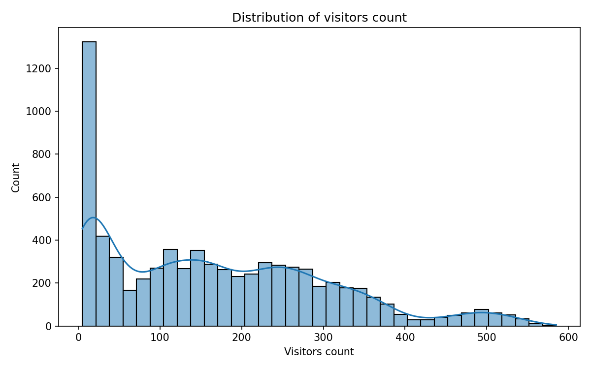
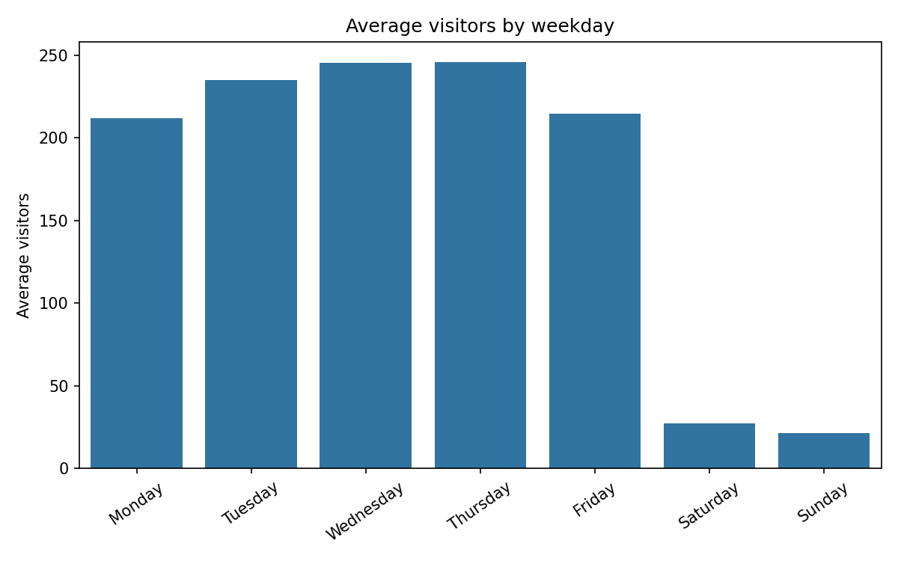
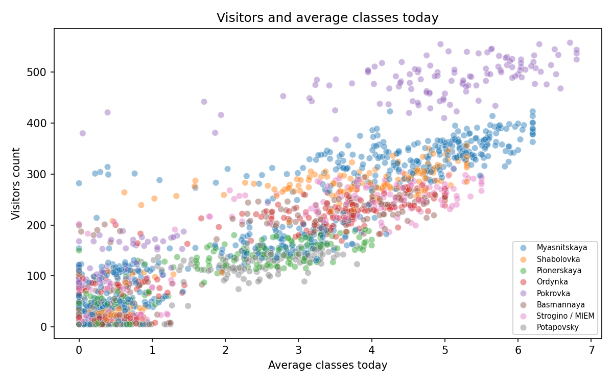
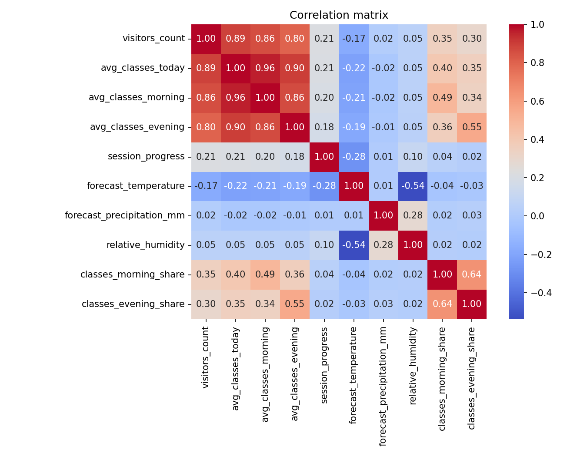
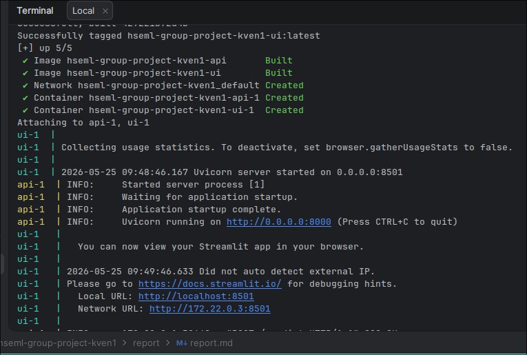
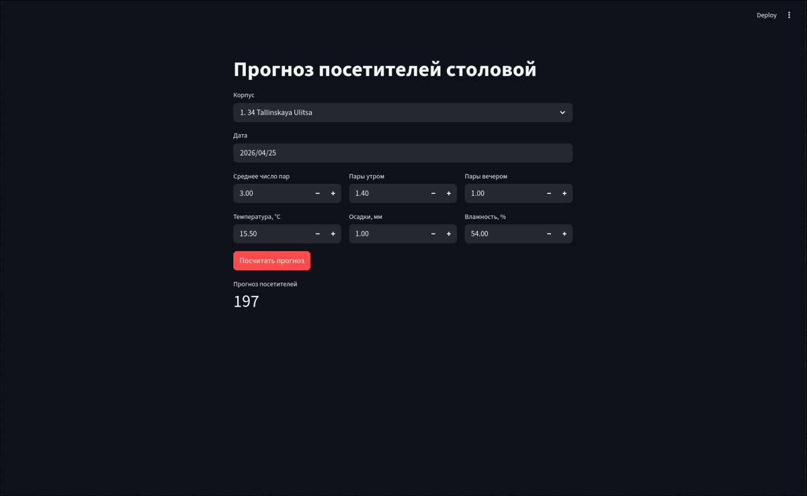

# Отчёт по проекту

**Студент:** Удалов Семён Борисович

**Группа:** 237

---

## 1. Введение и постановка задачи

Мы предсказываем, сколько человек придёт в столовую в конкретном корпусе в конкретный день. Это задача регрессии, target - `visitors_count`

Основная метрика - MAE, потому что она показывает среднюю ошибку в людях. Дополнительно считаю RMSE и R2, но финальную модель выбираю по MAE

---

## 2. Поиск и описание данных

Открытого датасета ежедневной посещаемости корпусов ВШЭ нет, поэтому основной датасет синтетический. Примерную логику обсудил с Сергеем Николаевичем, поэтому она должна быть схожа с реальной

Что использовал:

- погоду из Open-Meteo Historical Forecast API: температура, влажность, осадки
- 10 корпусов ВШЭ из `data/raw/buildings.csv`
- календарь ВШЭ: 4 модуля, сессии и проектные сессии

Запрос к Open-Meteo:

```text
https://historical-forecast-api.open-meteo.com/v1/forecast?latitude=55.7558&longitude=37.6176&start_date=2024-04-25&end_date=2026-04-25&daily=temperature_2m_mean,relative_humidity_2m_mean,precipitation_sum&timezone=Europe%2FMoscow&format=csv
```

После обработки получилось 7310 строк и 23 столбца. Одна строка - один корпус в один день. Период данных: `2024-04-25` - `2026-04-25`

---

## 3. Обработка и подготовка данных

Что сделал в `src/preprocessing.py`:

- удалил дубликаты
- привёл дату и числовые признаки к нормальным типам
- строки без `visitors_count` удаляются
- пропуски в признаках заполняются только по train: медиана для чисел, мода для категорий
- выбросы target обрабатываются IQR-методом по каждому корпусу, но clipping применяется только к train
- добавил новые признаки: `is_weekend`, `is_rainy`, `is_strong_rain`, `classes_morning_share`, `classes_evening_share`

Split сделал по времени, без перемешивания:

| Часть | Даты | Строк |
|---|---:|---:|
| train | `2024-04-25` - `2025-09-17` | 5110 |
| val | `2025-09-18` - `2026-01-05` | 1100 |
| test | `2026-01-06` - `2026-04-25` | 1100 |

Так нет подгляда в будущее: validation и test не участвуют в расчёте медиан, мод и границ выбросов.

Графики лежат в `report/images/`. В отчёт вставляю самые важные.






Основные выводы из EDA:

- медиана посещаемости - 153 человека, среднее - 171.5
- в будни средняя посещаемость 230.5, в выходные 24.2
- число пар сильно связано с посещаемостью: corr(`avg_classes_today`, target) = 0.892
- температура и осадки влияют слабее: corr(`forecast_temperature`, target) = -0.172, corr(`forecast_precipitation_mm`, target) = 0.015

---

## 4. Baseline-модель

Я сделал два простых baseline:

- `DummyRegressor` - всегда предсказывает среднее значение train
- `LinearRegression baseline` - линейная регрессия только на исходных признаках, без feature engineering

| Модель | MAE val | RMSE val | R2 val |
|---|---:|---:|---:|
| DummyRegressor | 118.248 | 144.825 | -0.0493 |
| LinearRegression baseline | 23.842 | 30.650 | 0.9530 |

Дальше сравниваю модели уже с `LinearRegression baseline`, потому что это простая модель без новых фичей

---

## 5. Эксперименты

Как проверялось: все модели обучались на train, качество считалось на validation. Препроцессинг признаков был внутри `sklearn.Pipeline`, чтобы не было утечек данных

| Модель | Гипотеза | Как проверялось | MAE val | RMSE val | R2 val |
|---|---|---|---:|---:|---:|
| DummyRegressor | среднее значение - нижняя граница | `strategy=mean` | 118.248 | 144.825 | -0.0493 |
| LinearRegression baseline | простая линейная модель уже должна поймать формулу | base-признаки, без FE | 23.842 | 30.650 | 0.9530 |
| LinearRegression FE | новые фичи могут немного улучшить линейную модель | base + FE | 23.586 | 30.423 | 0.9537 |
| Ridge FE | регуляризация может стабилизировать линейную модель | `alpha=1.0`, base + FE | 23.610 | 30.466 | 0.9536 |
| KNN FE | похожие дни должны иметь похожую посещаемость | `n_neighbors=7`, base + FE | 26.410 | 37.362 | 0.9302 |
| DecisionTree FE | деревья лучше ловят нелинейные правила | `max_depth=8`, base + FE | 14.560 | 21.118 | 0.9777 |
| GradientBoosting FE | бустинг должен улучшить одно дерево | `160` деревьев, `lr=0.06`, base + FE | 13.216 | 19.137 | 0.9817 |
| RandomForest FE | ансамбль деревьев должен снизить ошибку | `120` деревьев, `max_depth=12`, base + FE | 11.426 | 16.306 | 0.9867 |

Лучше всего на validation сработал `RandomForest FE`.

---

## 6. Финальная модель и интерпретируемость

Финальная модель - `RandomForestRegressor` с исходными и feature engineering признаками.

| Модель | MAE test | RMSE test | R2 test |
|---|---:|---:|---:|
| RandomForestRegressor | 11.827 | 16.878 | 0.9849 |

Как я это интерпретирую:

- главные факторы - число пар, корпус и день недели;
- это видно и из EDA: `avg_classes_today` имеет корреляцию 0.892 с target, а выходные сильно снижают поток;
- feature engineering дал маленький прирост для линейной модели: MAE 23.842 -> 23.586;
- деревья и ансамбли заметно лучше линейных моделей, потому что в данных есть пороги и нелинейности: выходные, сильный дождь, разные базовые потоки корпусов.

Важное ограничение: target синтетический и создан по формуле. Поэтому высокое качество показывает, что модель хорошо восстановила эту синтетическую зависимость. На реальных данных качество нужно проверять отдельно.

---

## 7. Деплой

Для деплоя сделал:

- FastAPI API: `src/api.py`;
- Streamlit-интерфейс: `src/streamlit_app.py`;
- запуск через Docker Compose.

Команда запуска:

```bash
docker compose up --build
```

После запуска:

- API: `http://localhost:8000`;
- Swagger: `http://localhost:8000/docs`;
- web-интерфейс: `http://localhost:8501`.

Пример запроса к API:

```bash
curl -X POST http://localhost:8000/predict \
  -H "Content-Type: application/json" \
  -d '{
    "date": "2026-04-25",
    "building_id": 1,
    "avg_classes_today": 4.0,
    "avg_classes_morning": 2.0,
    "avg_classes_evening": 1.0,
    "forecast_temperature": 12.5,
    "forecast_precipitation_mm": 1.2,
    "relative_humidity": 65.0
  }'
```

Ответ для этого примера:

```json
{"visitors_count": 232}
```

Скриншот запуска через Docker Compose:



Скриншот web-интерфейса:



Видео демонстрации деплоя: [ссылка на видео](https://drive.google.com/file/d/1lv7eed3zktKbAWEtU2U8Y_4Yz0Ci_LTf/view?usp=sharing)

---

## 8. Заключение и выводы

Что получилось:

- сделал синтетический датасет на 7310 строк;
- добавил очистку, feature engineering и временной split без data leakage;
- обучил baseline и несколько моделей;
- лучшая модель - `RandomForestRegressor`, MAE на test = 11.827;
- сделал деплой через FastAPI, Streamlit и Docker Compose.

Конечно, данные синтетические, поэтому результат нельзя напрямую переносить на реальную столовую. Если появится настоящий датасет со статистикой посещений, этот же пайплайн можно обучить уже на нём.
